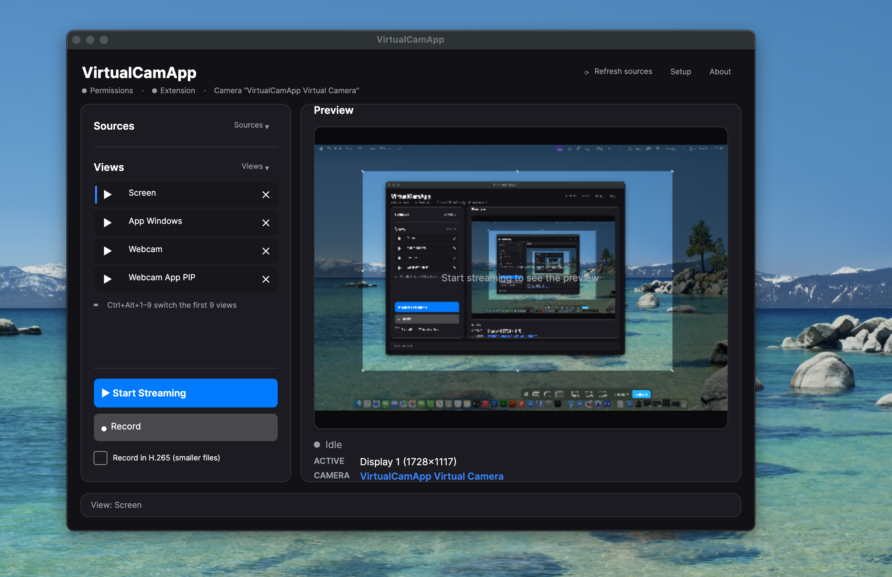

# VirtualCamApp

A virtual camera for **Windows** and **macOS** that other apps (Zoom, Teams, Meet, OBS, …) can select as a webcam — showing a **screen**, an **application window**, or a **real camera**, switchable live from the app.

- Picture-in-picture, side-by-side and stacked layouts
- Per-source crop / flip / rotate / colour fix, and a **Fit / Fill / Stretch** mode so the framing is exactly what other apps receive
- Quick-switch saved **Views** + global hotkeys (⌘⌥ / Ctrl+Alt + 1–9)
- Optional recording of the composited output to MP4
- No third-party software required

## How it works

VirtualCamApp is designed to be **set up once, then left running**. Day to day you just click a saved **View** to switch what your camera shows — the controls are only really needed for the initial setup and the occasional change.

## Quick start

1. **Install and open** VirtualCamApp. A short first-run wizard grants the permissions it needs, activates the virtual camera, and lets you name it.
2. **Build your Views.** Pick a source — a **screen**, an **app window**, or a **webcam** — tweak the framing (crop / flip / rotate / fit), then **Save** it as a View. Repeat for each thing you switch between.
3. **Select it in your meeting app.** In Zoom / Teams / Meet / OBS, choose your camera by the name you gave it (Settings ▸ Video).
4. **Switch instantly.** Click a View, or press **⌘⌥1–9** (macOS) / **Ctrl+Alt+1–9** (Windows) — even mid-call. No need to touch anything else.

## Download

Grab the latest build from the [**Releases**](../../releases) page:

- **macOS — Apple Silicon:** `VirtualCamApp-arm64.dmg`
- **macOS — Intel:** `VirtualCamApp-x64.dmg`
- **Windows — x64:** `VirtualCamApp-<version>-x64.msi`
- **Windows — ARM64:** `VirtualCamApp-<version>-arm64.msi`

> **macOS:** the DMGs are signed & notarized. On first launch, approve the camera extension in System Settings ▸ General ▸ Login Items & Extensions.
>
> **Windows:** the installers are unsigned, so SmartScreen may warn on first run — choose **More info ▸ Run anyway**.

## Troubleshooting

- **Other apps don't see the camera (macOS):** make sure the system extension is approved (System Settings ▸ General ▸ Login Items & Extensions), then restart the meeting app.
- **The picture looks stretched or cropped:** switch the **Fit** mode for that View (Fit keeps the whole source with bars; Fill crops to fill; Stretch fills exactly).
- **A View shows ⚠:** its source (a specific window/camera) isn't connected right now — reconnect it or pick another source.

---

> Source is maintained privately; this repository hosts the public releases and notes.
